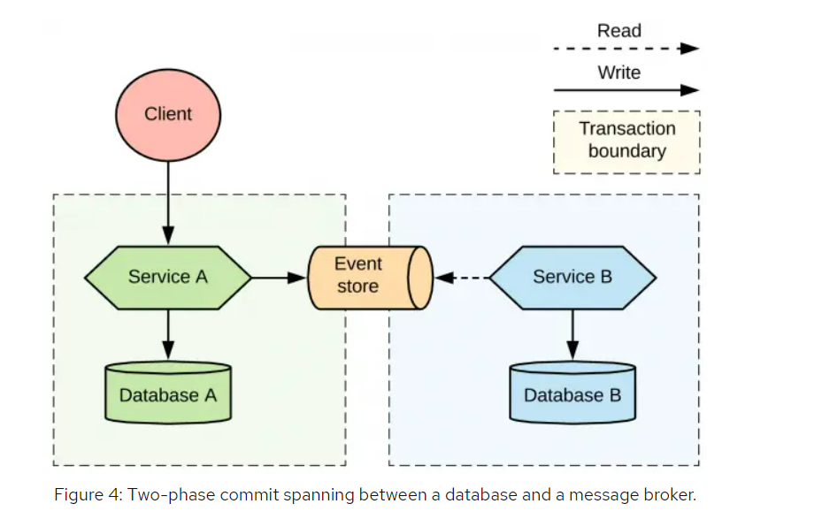
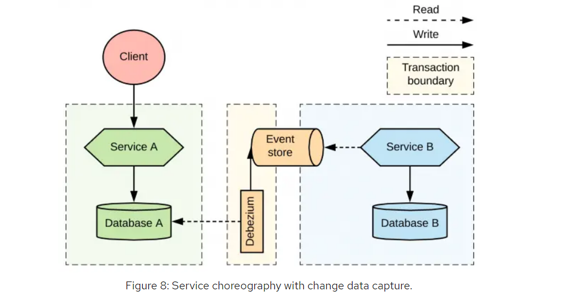

# Выбор архитектуры
При выборе стоит выбор между 3 паттернами:

Данный паттерн обеспечивает сильную согласованность, однако плохо масштабируется и очень медленный.

Самый простой паттерн - однако писать из сервиса B в сервис A плохая идея: правки в схеме A сломают сервис B.

Недостаток - множественная доставка.

В качестве итогового выбора был взят Debezium.

# Запуск приложения

Осуществляется командой docker-compose up --build

# Роуты

POST http://localhost:3000/producer/messages - создать сообщение в сервисе A

Тело запроса - {
    "creator": "alex",
    "recipient": "vasya",
    "mail": "How are you?"
}'

Ответ - {
    "status": true
}

GET http://localhost:3100/consumer/total - получить информацию о том, сколько сообщений попало в сервис B.

Ответ - {
    "total": 1
}

